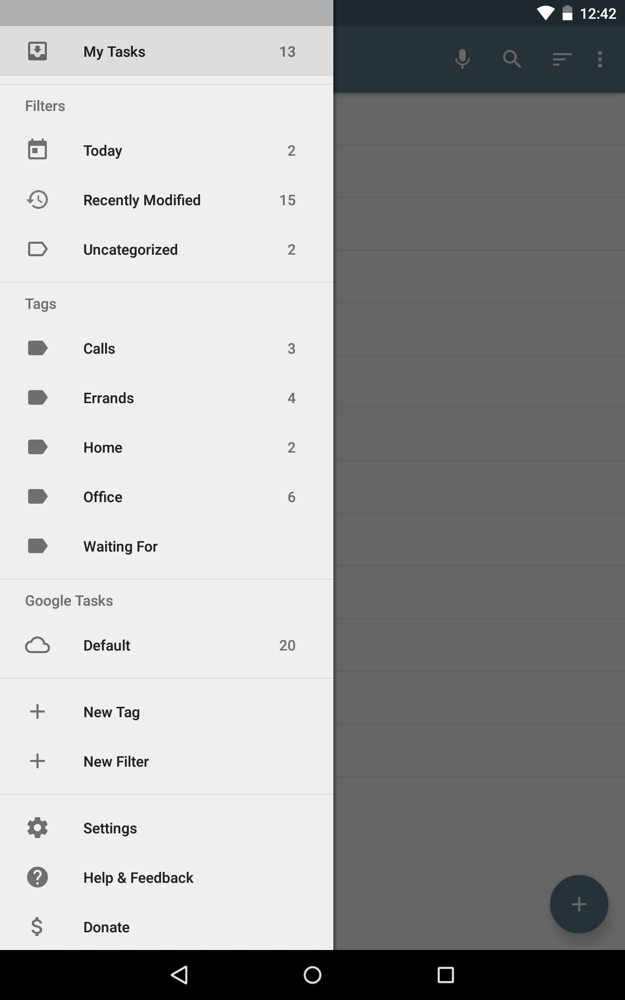
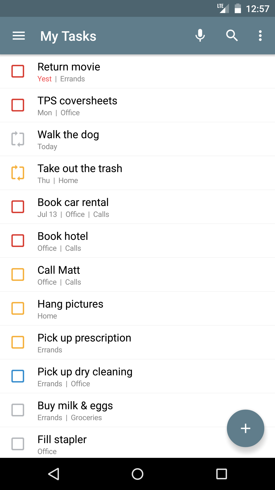
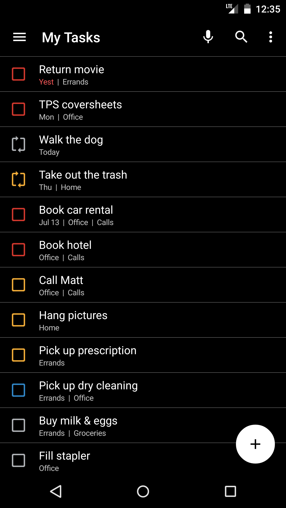
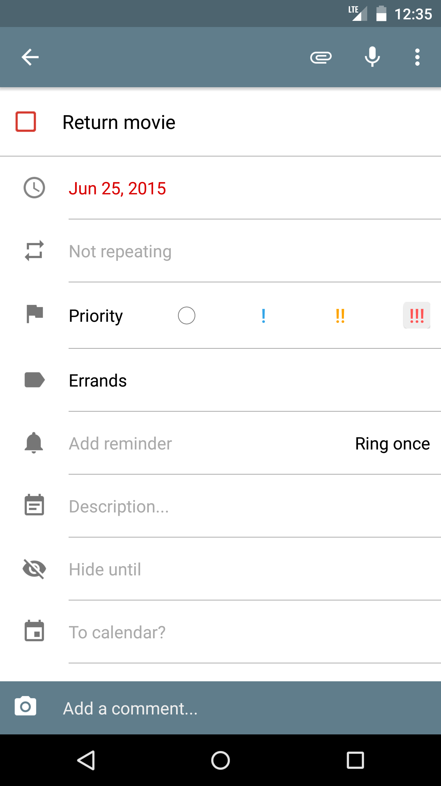
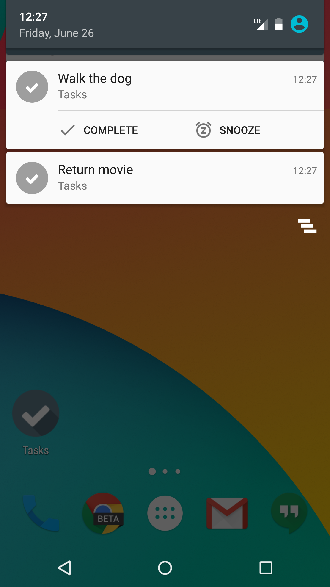
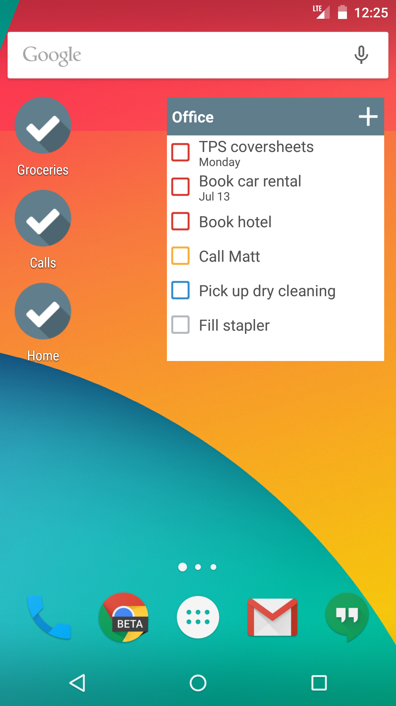
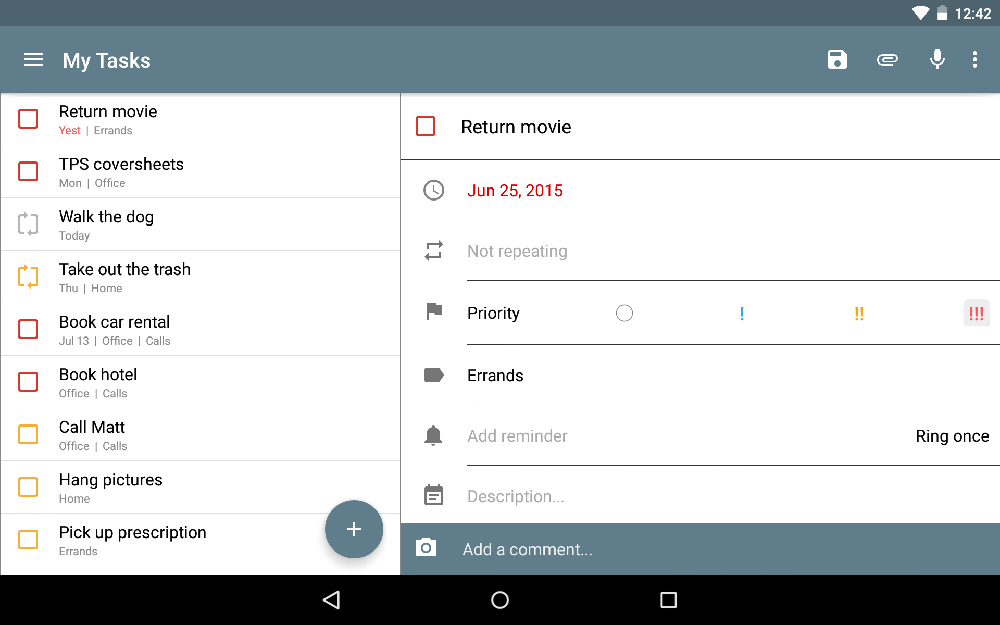

 

  

### Screenshots

Visit the wiki to
* [help with translations](https://github.com/tasks/tasks/wiki/Translations)
* [become a beta tester](https://github.com/tasks/tasks/wiki/Beta-Testing)
* [get started with development](https://github.com/tasks/tasks/wiki/Getting-Started-with-Development)
